How to deploy AI model to AIBox by Azure
===
---

# Table of Contents

-   [Introduction](#Introduction)
-   [Part 1: Config Azure Iot Hub](#part_1)
-   [Part 2: Create your IotEdge Module for AIBox](#part_2)
-   [Part 3: Config your IoT Edge Device](#part_3)
-   [Part 4: Deploy to your AIBox](#part_4)
-   [Part 5: Tutorials and Examples](#part_5)


<a name="Introduction"></a>
# Introduction

**About this document**

This document describes how to cover your AI Models, then deploy models to your AIBox via Azure Iot Hub.

<a name="part_1"></a>
# Part 1: Config Azure Iot Hub

## 1.1 Active your Azure account

AIBox can be configured to work with Microsoft Azure IoT resources. To get started, you will need a new or existing Azure account. You can create a free account by visiting [Azure link](https://azure.microsoft.com/free)

## 1.2 Setup IoT Hub and IoTEdge Device

Follow steps to [create your IoT Hub ](https://docs.microsoft.com/en-us/azure/iot-hub/iot-hub-create-through-portal) in advances

In the Azure portal, IoT Edge devices would be created and managed separately from devices that connect to your IoT hub but aren't edge-enabled. Follow below steps for configurations

- Sign in to the [Azure portal](https://portal.azure.com) and navigate to your IoT hub.

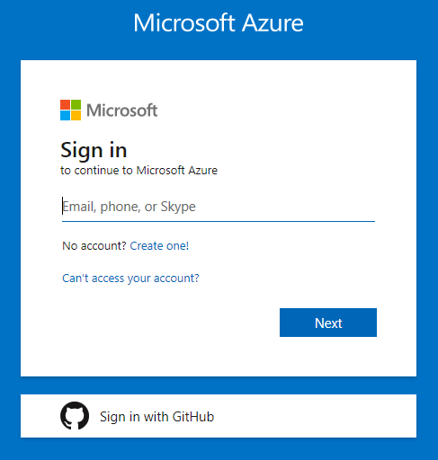

- Select IoT Edge from the menu.

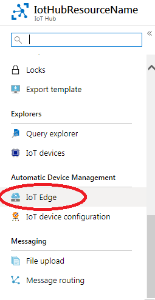

- Select Add an IoT Edge device

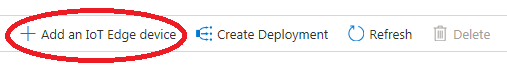

- Provide a descriptive device ID. Use the default settings to auto-generate authentication keys and connect the new device to your hub.
- Select Save.

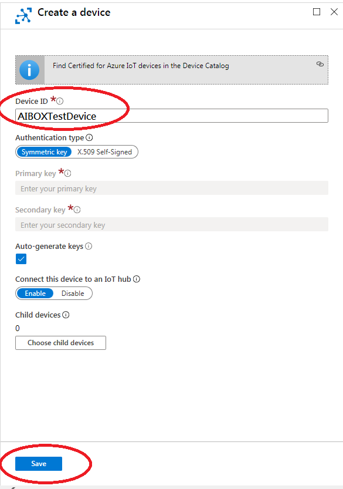
<a name="save_conectStr"></a>
- You will have one IoT Edge Devices Connect String (Primary connection String) for your AIBox

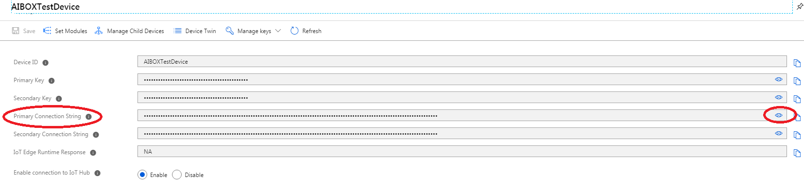

<a name="part_2"></a>
# Part 2: Create your IotEdge Module for AIBox

You have to create one edge device Module, running at AIBox. Please refer to [link](https://docs.microsoft.com/en-us/azure/iot-edge/tutorial-python-module#create-a-container-registry) for detail. 

May need register [docker hub](https://hub.docker.com/) account and public your container at docker hub (ex.  Account/folder:tagName)

Follows are some sample code by python for AIBox
- Model Deployment
```
shutil.copy("/app/Data/dlcFiles/ModelConfig_1.txt","/app/vam_model_folder/ModelConfig_1.txt")
                        shutil.copy("/app/Data/dlcFiles/ModelConfig_2.txt","/app/vam_model_folder/ModelConfig_2.txt")
                        copy_tree("/app/Data/dlcFiles/altekDLC1","/app/vam_model_folder/altekDLC1")
                        copy_tree("/app/Data/dlcFiles/altekDLC2","/app/vam_model_folder/altekDLC2")
```

- Receive Inference result by RTSP Client
```
cmd = ['gst-launch-1.0 ', ' -q ', ' rtspsrc ', ' location=' + result_src, ' protocols=tcp ',                                
       ' ! ', " application/x-rtp, media=application ", ' ! ', ' fakesink ', ' dump=true ']                                 
cmd = ''.join(cmd)                                                                                                                                                                                                                              
try:                                                                                                                        
    self._sub_proc = subprocess.Popen(                                                                                      
    cmd, shell=True, stdout=subprocess.PIPE, stderr=subprocess.PIPE, bufsize=1, universal_newlines=False)                                                                                                                               
    for _ in repeat(None):                                                                                                  
        line = self._sub_proc.stdout.readline()                                                                                                                                                                                         
        l_str = line[70:-1]                                                                                                 
        l_str = l_str.decode('utf-8')                                                                                       
        l_str = l_str.strip()                                                                                               
                                                                                                                    
        if ":[" in self._json_str and "] }" in self._json_str + l_str:                                                      
            # Only yield if objects are present in the inferences                                                           
            self._json_str = self._json_str + l_str                                                                         
            s_idx = self._json_str.index('{ "')                                                                             
            e_idx = self._json_str.index("] }") + 3                                                                         
            self._json_str = self._json_str[s_idx:e_idx]                                                                    
            result = self._get_inference_result()                                                                           
            self._json_str = ""                                                                                             
            yield result                                                                                                    
        elif ":[" not in self._json_str and '{ "' in self._json_str and " }" in self._json_str + 'l_str':                   
            self._json_str = ""                                                                                             
        else:                                                                                                               
            self._json_str = self._json_str + l_str                                                                         
        pass                                                                                                                
except subprocess.CalledProcessError as e:                                                                                  
    print(e)

```


<a name="part_3"></a>
# Part 3: Config your IoT Edge Device

1.	Select your IoT edge device, click on Set modules

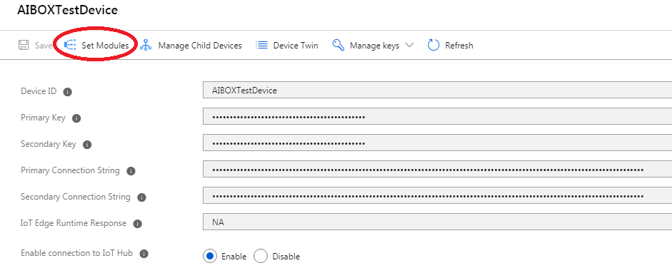

2. At Deployment modules section, click on Add => IoT Edge Module.

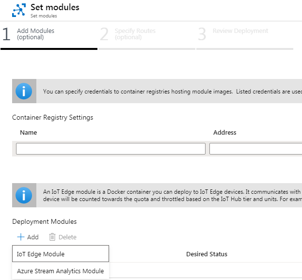

3. Fill out following details, and click save.

- Image URI: Account/folder:tagName
- Container Create Options: Redirect model files to path that they are really located at.
```
{
  "HostConfig": {
    "Binds": [
      "/data/misc/camera:/app/vam_model_folder"
    ],
    "NetworkMode": "host"
  },
  "NetworkingConfig": {
    "EndpointsConfig": {
      "host": {}
    }
  }
} 

```

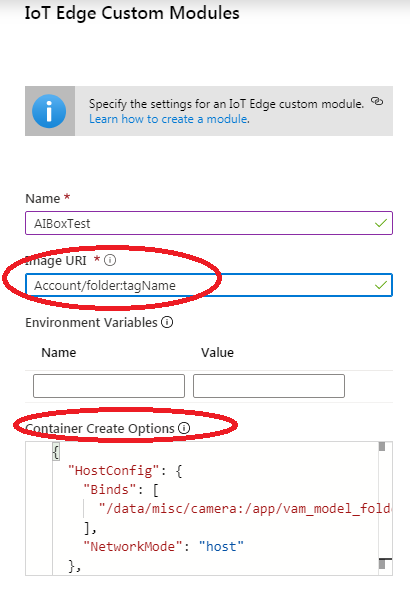


4.	Press Next at the 1st Add Modules (optional) tab in Set module page.

5.	Press Next at the 2nd Specify Routes (optional) tab to remains unchanged.

6. At the 3rd Review Deployment tab, press Submit

7. You will see there are 3 modules as below.

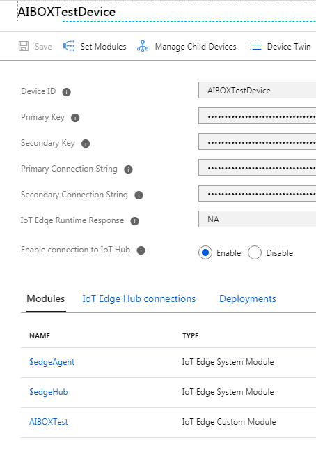

<a name="part_4"></a>
# Part 4: Deploy to your AIBox

You can follow below steps to deploy modules to AIBox

1. Refer to [Part 1](#part_1) to [get connection string](#save_conectStr)

2. Refer to [Quick Start Guiding for AIBox By Azure](./aibox-linux-for-edge.md) to setup network configuration of AIBox. Remember save your display out config before rebooting AIBox.

3.  Update connect string via ssh. Then, reboot device.

<a name="part_5"></a>
# Part 5: Tutorials and Examples

Power on your AIBox, then wait for status LED as below before further actions

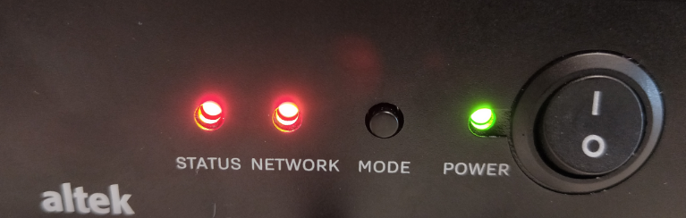

## 5.1 Connect your AIBox with PC via Wi-Fi
At your PC side, please connect to a Wi-Fi network, named as altek_edgebox**** (**** is the last 4 characters of the device’s Wi-Fi MAC address, e.g. altek_edgebox9613). Then, you can follow step 1.1 or 1.2 to redirect AIBox network to Wi-Fi AP or Ethernet router. Password of AIBox AP is "12345678"


## 5.2 Direct your AIBox to a Wi-Fi AP (internet available for Azure)

Open web browser (e.g. Chrome) by link http://192.168.143.1/ to  AP setting webpage. 
Then, input SSID/Password for one internet-available Wi-Fi AP. AIBox nework will be redirected to your assigned Wi-Fi AP.

 

## 5.3 Update connect string via SSH
If you already complete above network settings, you can enter linux shell via SSH.
Information for SSH access will be below
-  IP of SoftAP at AIBox: 192.168.143.1
-  Account: root
-  Password: oelinux123

Terminal, like putty, will be available for ssh access

 

## Update conenct string via SSH

You may use below shell cmd via SSH to update connect string into device.

```
sed -i '/ device_connection_string: /c\  device_connection_string: "HostName={hub_name}.azure-devices.net;DeviceId=MyEdgeDeviceName;SharedAccessKey={key}"' /etc/iotedge/config.yaml
```

Then, you can use below cmd to reboot AIBox via SSH
Wait for minutes to see all LED off, then have Power-On status

```
reboot -f
```

## Wait for your moduel deployment

After device reboot, wait for AIBOX to connect to Wi-Fi AP. LED will show as below onec internet is ready.

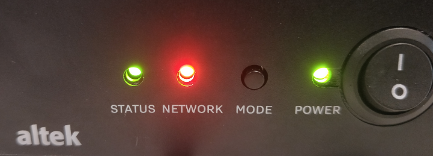

you may wait for minutes, depending on internet througput, to complete modules download from Azure to AIBox.

You can check by below cmd via SSH

```
docker ps
```
There should be 3 containers, edgeAgent, edgeHub, and your AIBox Module, running inside docker.

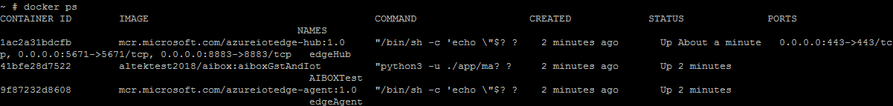


## 5.4 Config your IPCamera via Web UI

Power on you IPCameras. If you have ever config relative setting as below, AIBox will collect camera streaming to apply inference on edge side. (You can ignore below 2 steps if your IPCameras have been pairted with AIBox already)

### View preview at Web UI
Once Wi-Fi connecting successfully, it will redirect to AIBOX IPC preview/config webpage (http://192.168.143.1:9080)

At IPC preview/configure webpage, all Onvif IPCs are scanned and listed. And you can press "Refresh“ to scan again.

You have to input username/password for Onvif IPCamera  to login. To simplify operating scenarios, all IPCameras’ account recommend be identical. Then, click camera link which you perfer start preview at web

 

 ### Config your display out via Web UI
You have to config your display out via Web UI


Click "Reflash" to scan avaialble IPCameras, then enable x1~x4 cameras as below

Remember to click "Save". After saving configuration, AIBox will reconnect cameras automatically while AIBox boot-up next time.


## 5.5 Inference running at AIBox

Wait for IPCameras connecting to your AIBox. Once connection is ready, LED status will show as below

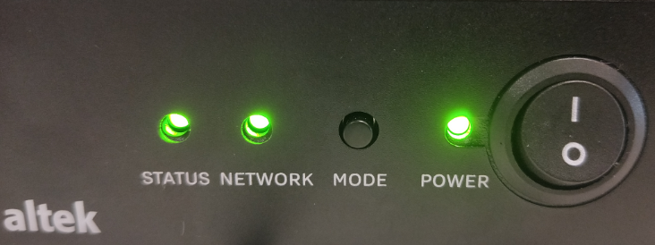


Then, force to restart docker service via SSH.
```
systemctl restart docker.service
```

Wait for iot edge runtime ready to start inference. You can check status by below cmd via SSH
```
docker ps
```


And also can check detail logs for each containers by below cmds via SSH

```
docker logs -f edgeAgent
docker logs -f edgeHub
docker logs -f your_AIBox_Module
```

Take Altek AIBOXTest Module for example
Metadata will be streaming out continually to IoT Hub. And you can get inference result by docker logs

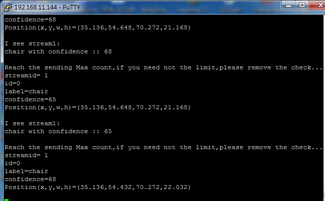


HDMI display is also available to streaming out with bounding box UI.

