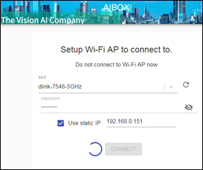
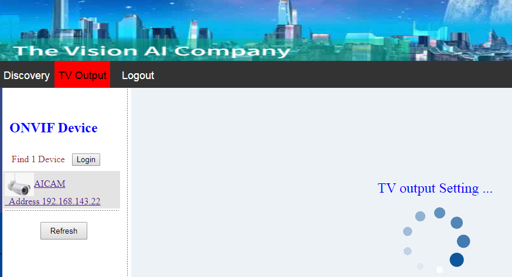
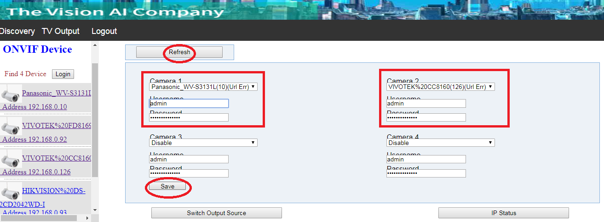

Run a simple python sample on Altek AIBox device running embedded Linux by Yocto
===
---

# Table of Contents

-   [Introduction](#Introduction)
-   [Step 1: Prerequisites](#Prerequisites)
-   [Step 2: Prepare your Device](#PrepareDevice)
-   [Step 3: Manual Test for Azure IoT Edge on device](#Manual)
-   [Step 4: Next Steps](#NextSteps)
-   [Step 5: Troubleshooting](#Step-5-Troubleshooting)


<a name="Introduction"></a>
# Introduction

**About this document**

This document describes how to connect Altek AIBox device running embedded Linux by Yocto with Azure IoT Edge Runtime pre-installed and Device Management. This multi-step process includes:

-   Configuring Azure IoT Hub
-   Registering your IoT device
-   Build and Deploy client component to test device management capability 

<a name="Prerequisites"></a>
# Step 1: Prerequisites

You should have the following items ready before beginning the process:

-   [Prepare your development environment][setup-devbox-linux]
-   [Setup your IoT hub](https://account.windowsazure.com/signup?offer=ms-azr-0044p)
-   [Provision your device and get its credentials][lnk-manage-iot-hub]
-   [Sign up to IOT Hub](https://account.windowsazure.com/signup?offer=ms-azr-0044p)
-   [Add the Edge Device](https://docs.microsoft.com/en-us/azure/iot-edge/quickstart-linux)
-   [Add the Edge Modules](https://docs.microsoft.com/en-us/azure/iot-edge/quickstart-linux#deploy-a-module)
-   [Altek AIBox device](https://store.altek.com.tw/qualcomm/product/ai-box-altek#TECH-NODE)
-   x1~x4 IPCam, compatible with Onvif profile-s and RTSP
-   A router for wired/wireless connection to internet

<a name="PrepareDevice"></a>
# Step 2: Prepare your Device

This section will guide you to setup connection between IPCamera and AIBox. 

Before starting setup, you may refer to below LED indicator/ Button scenarios at AIBox
 

 

## What you will do for network configuration

### 2.1 Network setup for AIBox 

#### 2.1.1 Connect your AIBox with PC via Wi-Fi
At your PC side, please connect to a Wi-Fi network, named as altek_edgebox**** (**** is the last 4 characters of the device’s Wi-Fi MAC address, e.g. altek_edgebox9613). Then, you can follow step 1.1 or 1.2 to redirect AIBox network to Wi-Fi AP or Ethernet router. Password of AIBox AP is "12345678"


#### 2.1.2 Direct your AIBox to a Wi-Fi AP

Open web browser (e.g. Chrome) by link http://192.168.143.1/ to  AP setting webpage. 
Then, input SSID/Password for one internet-available Wi-Fi AP. AIBox nework will be redirected to your assigned Wi-Fi AP.

 

Once Wi-Fi connecting successfully, it will redirect to AIBOX IPC preview/config webpage (http://192.168.143.1:9080)


#### 2.1.3 Direct your AIBox to an ethernet router

If ethernet is connected to AIBOX already, open web browser (e.g. Chrome) by link http://192.168.143.1/, it will be redirected to login webpage automatically.

#### 2.1.4  Login for IPC preview/configure webpage

Please input Username/Password as "admin/admin“, then press "Login" to enter IPC preview/configure webpage.



<a name="2_1_5_ToSSH"></a>
 #### 2.1.5 Confirm network configuration by Linux shell over SSH
If you already complete above network settings, you can enter linux shell via SSH.
Information for SSH access will be below
-  IP of SoftAP at AIBox: 192.168.143.1
-  Account: root
-  Password: oelinux123

Terminal, like putty, will be available for ssh access

 

Once ssh is available, you can use "ifconfig" to check network configurations


#### 2.1.6 Update Azure IoTEdge Device connect string via SSH

AIBox support Azure Iot Hub. It can be one Azure Iot Edge Device.
If you already [create your own connect string for Auzre IotEdge Device](https://docs.microsoft.com/en-us/azure/iot-edge/quickstart-linux#deploy-a-module), you may use below shell cmd via SSH to update connect string into device.

```
sed -i '/ device_connection_string: /c\  device_connection_string: "HostName={hub_name}.azure-devices.net;DeviceId=MyEdgeDeviceName;SharedAccessKey={key}"' /etc/iotedge/config.yaml
```

Then, you can use below cmd to reboot AIBox via SSH
Wait for minutes to see all LED off, then have Power-On status

```
reboot
//systemctl daemon-reload
//systemctl restart iotedge.service
```

### 2.2 Connect your IPCamera to Wi-Fi AP or ethernet router.

You may prepare x1~x4 IPCameras, compatible with OnVIF + RTSP protocol. 
Please refer to user manual of IPCameras to setup your IPCamera, and direct your camera to to the same Wi-Fi AP or ethernet router as AIBox.

Following cameras are validated with AIBox for your reference.
- Sony: SNC-EB630
- Panasonic: WV-D3131L
- HIKVISION: DS-2CD1021FD-IW1, DS-2CD2042WD-I
- Dahua: HFW4233F-ZSA, HDW-4438C-A, HDW-4438C-A-V2
- Axis: M3007, M3045V
- Vivotek: CC8160


### 2.3 Config your IPCamera via Web UI
At IPC preview/configure webpage, all Onvif IPCs are scanned and listed. And you can press "Refresh“ to scan again.

 

You have to input username/password for Onvif IPCamera  to login. To simplify operating scenarios, all IPCameras’ account recommend be identical. Then, click camera link to start preview at web

 

 ### 2.4 Config your display out via Web UI
If you would like have start video analytic or HDMI display, you have to config your display out via Web UI



Click "Reflash" to scan avaialble IPCameras, then enable x1~x4 cameras as below

Remember to click "Save". After saving configuration, AIBox will reconnect cameras automatically while AIBox boot-up next time.



### 2.5 Reset your network configuration
Pinghole reset button as below. Network configuration will be reset


<a name="Manual"></a>
# Step 3: Manual Test for Azure IoT Edge on device

This section walks you through the test to be performed on the Edge devices running the Linux operating system such that it can qualify for Azure IoT Edge certification.

<a name="Step-3-1-IoTEdgeRunTime"></a>
## 3.1 Edge RuntimeEnabled (Mandatory)

**Details of the requirement:**

The following components come pre-installed or at the point of distribution on the device to customer(s):

-   Azure IoT Edge Security Daemon
-   Daemon configuration file
    ontainer management system  A version of `hsmlib` 

*Edge Runtime Enabled:*

**Check the iotedge daemon command:** 

Open the command prompt (Refer to ["2.1.5 Confirm network configuration by Linux shell over SSH"](#2_1_5_ToSSH)) on your IoT Edge device , confirm that the Azure IoT edge Daemon is under running state

    systemctl status iotedge

 

Open the command prompt on your IoT Edge device, confirm that the module deployed from the cloud is running on your IoT Edge device

    sudo iotedge list

  

On the device details page of the Azure, you should see the runtime modules - edgeAgent, edgeHub and tempSensor modueles are under running status

 

<a name="Step-3-2-DeviceManagement"></a>
## 3.2 Device Management (Optional)

**Pre-requisites:** Device Connectivity.

**Description:** A device that can perform basic device management operations (Reboot and Firmware update) triggered by messages from IoT Hub.

## 3.2.1 Firmware Update 

To Be Updated

## 3.2.2 Reboot 

To Be Updated

  

<a name="NextSteps"></a>
# Step 4: Next steps

You can move to [How to have AI model running at AIBox](./AI_Model_to_AIBox.md)

<a name="Step-5-Troubleshooting"></a>
# Step 5: Troubleshooting

Please contact engineering support on **<alsenechien@altek.com.tw>** for help with troubleshooting.
  
[setup-devbox-linux]: https://github.com/Azure/azure-iot-sdk-c/blob/master/doc/devbox_setup.md
[lnk-setup-iot-hub]: ../setup_iothub.md
[lnk-manage-iot-hub]: ../manage_iot_hub.md
